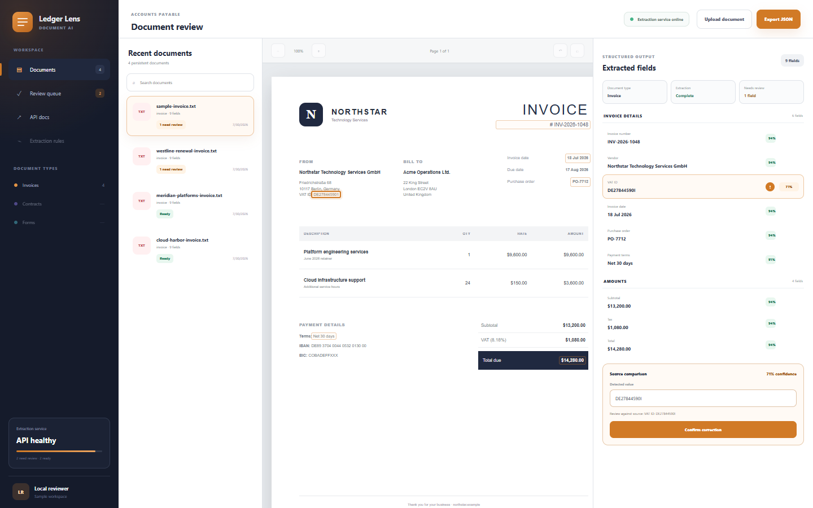
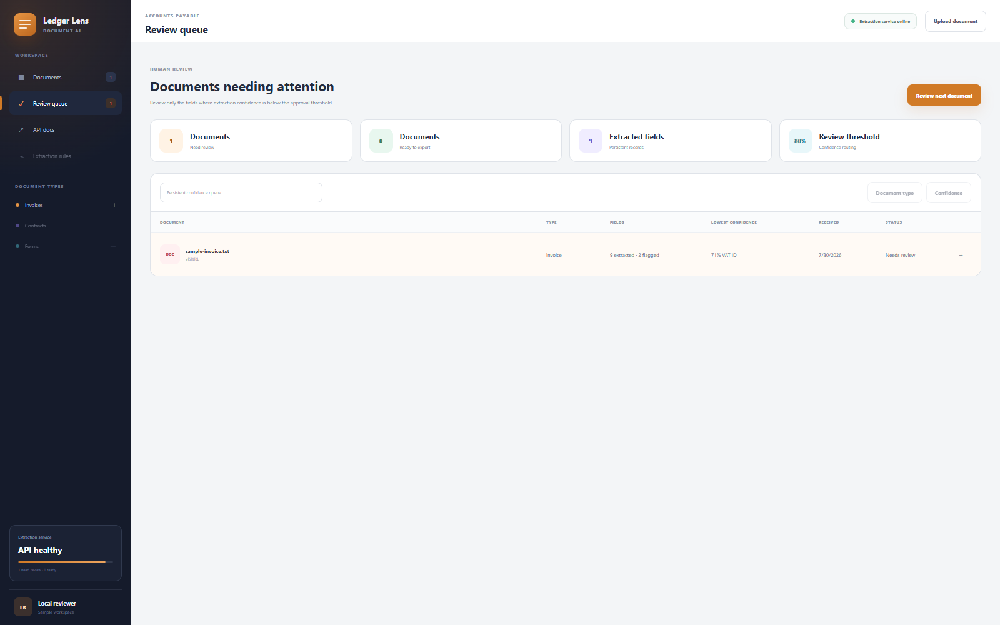

# Ledger Lens

[](https://github.com/sutasmantas/invoice-extraction-pipeline/actions/workflows/ci.yml)
[](pyproject.toml)
[](LICENSE)

**Convert invoices into reviewed, normalized JSON without hiding uncertain
fields.**

Ledger Lens combines configurable invoice templates, PDF text extraction,
image-only PDF rasterization, Tesseract OCR, line-item parsing, source
provenance, confidence routing, correction history, and structured export. The
useful unit is not “OCR text”; it is a reviewable document record that keeps the
source page and line beside every field decision.



## Try the review queue

[Open the live document workspace](https://sutasmantas.github.io/invoice-extraction-pipeline/)

[](https://codespaces.new/sutasmantas/invoice-extraction-pipeline?quickstart=1)
[](https://render.com/deploy?repo=https://github.com/sutasmantas/invoice-extraction-pipeline)

The Codespace installs Tesseract, installs the Python package, and starts the
interface on port 8000. Four fictional invoices are seeded across ready and
needs-review states, so the queue, correction and export workflows are useful
immediately.

The Render blueprint includes OCR through the repository Docker image. Free
Render instances sleep and their SQLite review state can reset.

<details>
<summary>See the persistent review queue</summary>



</details>

## What is implemented

- configurable YAML/JSON invoice schemas and typed parsers through the pinned
  invoice2data foundation
- PDFium text extraction and page rendering for text-layer and image-only PDFs
- Tesseract OCR for rasterized PDFs, PNG, JPG, WEBP, and TIFF images
- invoice fields and line items with normalization and validation
- confidence-based routing across a multi-document review queue
- page/line/method/template provenance for matched fields and named line items
- source-linked correction with append-only SQLite history
- server-generated structured JSON export
- honest transcript rendering for uploaded documents
- FastAPI, automated tests, Docker, and GitHub Actions

The application seeds four fictional invoices: two are ready to export and two
contain a field that needs review. Uploaded source files are processed in a
temporary directory and are not retained.

## Run locally

Requirements: Python 3.11+ and Tesseract for image and image-only PDF OCR.
Install the vendored Atlas-owned contract wheel before the project:

```powershell
python -m pip install vendor\portfolio_document_contract-0.1.0-py3-none-any.whl
python -m pip install -e ".[dev]"
```

Every production extraction now crosses the versioned normalized-document
contract before invoice-specific field, review, and correction policy runs.
The vendored wheel SHA-256 is
`b9a52899661f423911c4c5adfcf891e7741cdf8ae4dcbdc787a059fbc5c645b4`,
reproducibly built from Atlas provider commit
`fc0c31755258ad8860d0690b9bd7c4fc6b1f8463`;
its canonical schema SHA-256 is
`881af595d1a26f2e3c688a3c233a947222014f542a8f9879b13e91a39cec608c`.

```bash
python -m venv .venv
python -m pip install -e ".[dev]"
uvicorn ledger_lens.main:app --reload
```

Open <http://localhost:8000>. API documentation is available at
<http://localhost:8000/docs>.

Text PDFs and text files work without Tesseract. On Windows, set
`LEDGER_TESSERACT_CMD` if `tesseract.exe` is not on `PATH`.

## Docker

```bash
docker compose up --build
```

The image installs Tesseract and persists review state in the `ledger-data`
volume.

## API

| Method | Endpoint | Purpose |
| --- | --- | --- |
| `GET` | `/api/documents` | List extracted documents and fields |
| `POST` | `/api/documents` | Extract an uploaded document |
| `PATCH` | `/api/documents/{id}/fields/{name}` | Persist a reviewed value |
| `GET` | `/api/documents/{id}/corrections` | Return ordered correction history |
| `GET` | `/api/documents/{id}/export` | Return normalized structured data |

## Verification

Ledger Lens is a real consumer of AdapterProof's reusable OpenAPI contract
gate. The consumer file fixes the app, disposable state, exact operation,
deterministic phase, seed, and 30-second budget; the shared GitHub workflow owns
tool installation, process isolation, NDJSON classification, and receipt
upload.

```powershell
<adapterproof-tool-python> -m adapterproof openapi `
  --config adapterproof.openapi.json `
  --consumer-python .\.venv\Scripts\python.exe `
  --report-dir .evidence\openapi
```

This profile verifies the real `GET /api/health` response over TCP against the
application's generated OpenAPI document. AdapterProof is pinned at
`fa0296f4294b5149605c5fbf4e809adddba76e74`; its upstream Schemathesis engine is
pinned independently inside the shared workflow.

```bash
ruff check .
pytest --cov=ledger_lens --cov-report=term-missing
ledger-lens-benchmark tests/fixtures/invoice2data
```

Tests cover configurable extraction, public-fixture fields and line items,
provenance, low-confidence routing, append-only correction history, normalized
export, text upload, and invalid file handling. The fixed scanned-PDF benchmark
requires real Tesseract and is run in the Docker image; its committed report is
[`docs/evidence/ledger_lens_benchmark.json`](docs/evidence/ledger_lens_benchmark.json).

## Architecture

See [docs/architecture.md](docs/architecture.md).

## License

MIT
